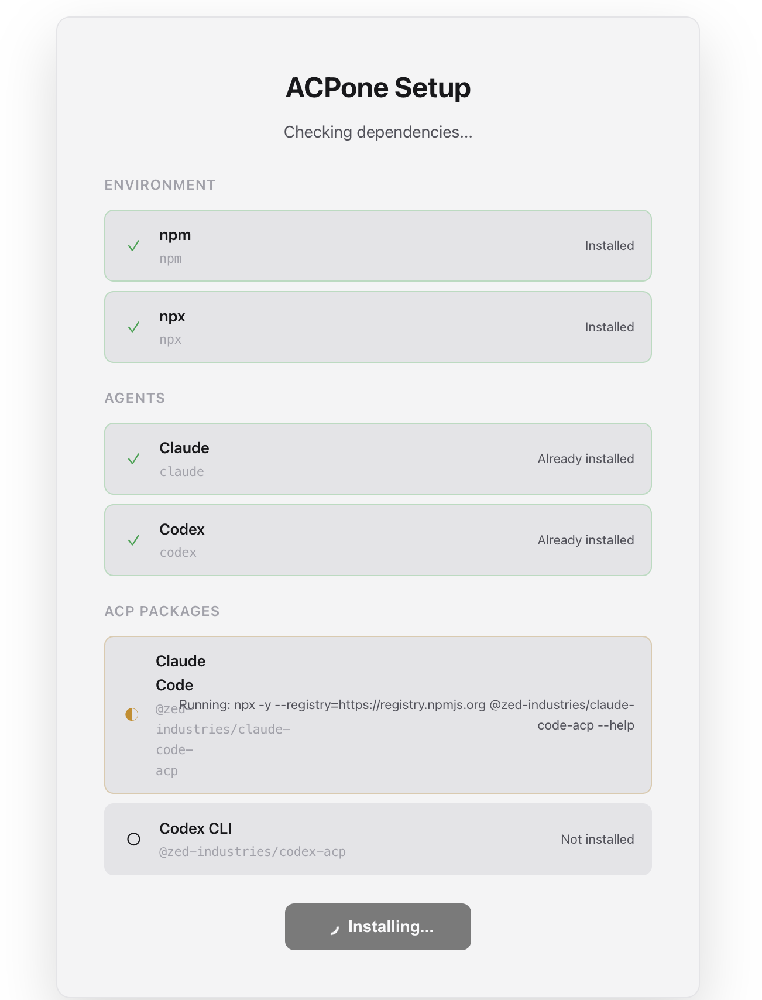
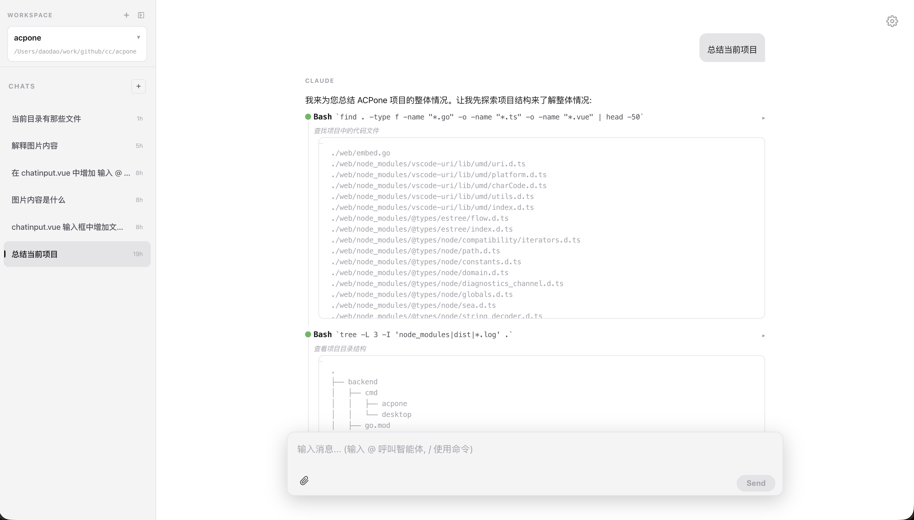

# ACPone

基于 [ACP](https://agentclientprotocol.com/protocol/overview) 协议 - 同时调度多个 AI Agent 的 ChatBot。

## 功能特性

- 多 Agent 支持 (Claude Code, Codex 等)
- 多工作区管理
- 会话历史持久化
- 实时流式响应 (SSE)
- 权限确认机制
- 深色/浅色主题
- 中英文切换

## 预览





## 架构图

```
┌─────────────────────────────────────────────────────────────────────┐
│                         Browser (Vue 3 + TypeScript)                 │
│                                                                      │
│   ┌──────────┐   ┌───────────────┐   ┌───────────┐   ┌──────────┐  │
│   │ Sidebar  │   │ ChatContainer │   │ ChatInput │   │ Settings │  │
│   │          │   │               │   │           │   │  Modal   │  │
│   │ Sessions │   │  Messages     │   │ @mentions │   │          │  │
│   │ Workspace│   │  ToolCalls    │   │ /commands │   │ Agents   │  │
│   └────┬─────┘   └───────┬───────┘   └─────┬─────┘   └──────────┘  │
│        │                 │                 │                        │
│        └─────────────────┼─────────────────┘                        │
│                          ▼                                          │
│                   ┌─────────────┐                                   │
│                   │ session.ts  │  State Management                 │
│                   └──────┬──────┘                                   │
│                          ▼                                          │
│                   ┌─────────────┐                                   │
│                   │  api/       │  HTTP + Server-Sent Events        │
│                   └──────┬──────┘                                   │
└──────────────────────────┼──────────────────────────────────────────┘
                           │
                           │ HTTP / SSE
                           ▼
┌──────────────────────────────────────────────────────────────────────┐
│                          Go Backend                                   │
│                                                                       │
│   ┌───────────────────────────────────────────────────────────────┐  │
│   │                        HTTP Server                             │  │
│   │  /api/chat    /api/sessions    /api/agents    /api/workspaces │  │
│   └───────────────────────────┬───────────────────────────────────┘  │
│                               │                                       │
│          ┌────────────────────┼────────────────────┐                 │
│          ▼                    ▼                    ▼                 │
│   ┌─────────────┐     ┌─────────────┐      ┌─────────────┐          │
│   │   Router    │     │  Session    │      │ Conversation│          │
│   │             │     │  Storage    │      │   Manager   │          │
│   │ @mention    │     │             │      │             │          │
│   │ keywords    │     │ ~/.config/  │      │  In-memory  │          │
│   └──────┬──────┘     └─────────────┘      └─────────────┘          │
│          │                                                           │
│          ▼                                                           │
│   ┌─────────────────────────────────────────────────────────────┐   │
│   │                     Agent Manager                            │   │
│   │                                                              │   │
│   │   ┌─────────────┐   ┌─────────────┐   ┌─────────────┐       │   │
│   │   │   Agent 1   │   │   Agent 2   │   │   Agent N   │       │   │
│   │   │ (claude)    │   │  (codex)    │   │   (...)     │       │   │
│   │   └──────┬──────┘   └──────┬──────┘   └──────┬──────┘       │   │
│   │          │                 │                 │               │   │
│   └──────────┼─────────────────┼─────────────────┼───────────────┘   │
│              │                 │                 │                    │
└──────────────┼─────────────────┼─────────────────┼────────────────────┘
               │ JSON-RPC        │ JSON-RPC        │ JSON-RPC
               ▼                 ▼                 ▼
        ┌─────────────┐   ┌─────────────┐   ┌─────────────┐
        │ claude-code │   │   codex     │   │    ...      │
        │  process    │   │  process    │   │  process    │
        └─────────────┘   └─────────────┘   └─────────────┘
```

## 消息流程图

```
用户输入消息
      │
      ▼
┌─────────────────┐
│  ChatInput.vue  │  检测 @mentions, /commands
└────────┬────────┘
         │
         ▼
┌─────────────────┐
│  session.ts     │  commitStreamItems() + addUserMessage()
└────────┬────────┘
         │
         ▼
┌─────────────────┐
│  api/index.ts   │  POST /api/chat (SSE)
└────────┬────────┘
         │
         ▼
┌─────────────────┐
│  chat.go        │  解析请求, 路由到 Agent
└────────┬────────┘
         │
         ▼
┌─────────────────┐
│  router.go      │  根据 @mention/keywords 选择 Agent
└────────┬────────┘
         │
         ▼
┌─────────────────┐
│  manager.go     │  获取或启动 Agent 进程
└────────┬────────┘
         │
         ▼
┌─────────────────┐
│  rpc.go         │  JSON-RPC 通信
└────────┬────────┘
         │
         ▼
┌─────────────────┐
│  Agent Process  │  处理请求, 流式响应
└────────┬────────┘
         │
         │ events (message, tool_call, etc.)
         ▼
┌─────────────────┐
│  chat.go        │  SSE 推送到前端
└────────┬────────┘
         │
         ▼
┌─────────────────┐
│  session.ts     │  addStreamingText() / addToolCall()
└────────┬────────┘
         │
         ▼
┌─────────────────┐
│ ChatContainer   │  实时渲染消息和工具调用
└─────────────────┘
```

## 快速开始

### 1. 安装依赖

```bash
# 前端
cd web && npm install

# 后端 (Go 1.21+)
cd backend && go mod download
```

### 2. 配置

首次启动时，如果没有找到配置文件，会自动创建 `~/.acpone/acpone.config.json`。

你也可以手动复制配置文件:
```bash
mkdir -p ~/.acpone
cp backend/acpone.config.example.json ~/.acpone/acpone.config.json
```

### 3. 开发模式

```bash
# 终端 1: 启动后端
cd backend && go run ./cmd/acpone

# 终端 2: 启动前端 (热重载)
cd web && npm run dev
```

访问 http://localhost:5173

### 4. 生产构建

```bash
# 构建嵌入式单文件
cd web && npm run build:togo
cd ../backend && go build -o acpone ./cmd/acpone

# 运行
./acpone
```

访问 http://localhost:3000

## 配置说明

### 配置文件位置

配置文件按以下顺序搜索（使用第一个找到的）:

1. `./acpone.config.json` - 当前目录
2. `./acpone.json` - 当前目录
3. `~/.acpone/acpone.config.json` - 用户目录 (首次启动自动创建)
4. `~/.config/acpone/config.json` - XDG 配置目录

### 配置格式

```json
{
  "agents": [
    {
      "args": [
        "-y",
        "@zed-industries/claude-code-acp"
      ],
      "command": "npx",
      "env": {
        "ANTHROPIC_AUTH_TOKEN": "aicoding-xxxxx",
        "ANTHROPIC_BASE_URL": "https://api.aicoding.sh",
        "API_TIMEOUT_MS": "600000"
      },
      "id": "claude",
      "name": "Claude Code",
      "permissionMode": "default"
    },
    {
      "args": [
        "-y",
        "@zed-industries/codex-acp"
      ],
      "command": "npx",
      "env": {
        "OPENAI_API_KEY": "aicoding-xxxxx",
        "OPENAI_BASE_URL": "https://api.aicoding.sh/v1"
      },
      "id": "codex",
      "name": "Codex CLI",
      "permissionMode": "default"
    }
  ],
  "defaultAgent": "claude",
  "routing": {
    "keywords": {
      "@claude": "claude",
      "@codex": "codex"
    },
    "meta": true
  }
}
```

### Agent 权限模式

- `default`: 敏感操作需要用户确认
- `bypass`: 自动批准所有操作 (谨慎使用)

### 路由规则

- `@agent-id`: 使用 @ 指定 Agent
- `keywords`: 关键词匹配路由
- `meta`: 启用元路由 (Agent 可以路由到其他 Agent)

## 技术栈

**前端:**
- Vue 3 (Composition API)
- TypeScript
- Vite
- markstream-vue (Markdown 渲染)

**后端:**
- Go 1.21+
- 内嵌静态文件 (go:embed)
- JSON-RPC 2.0

## License

MIT
